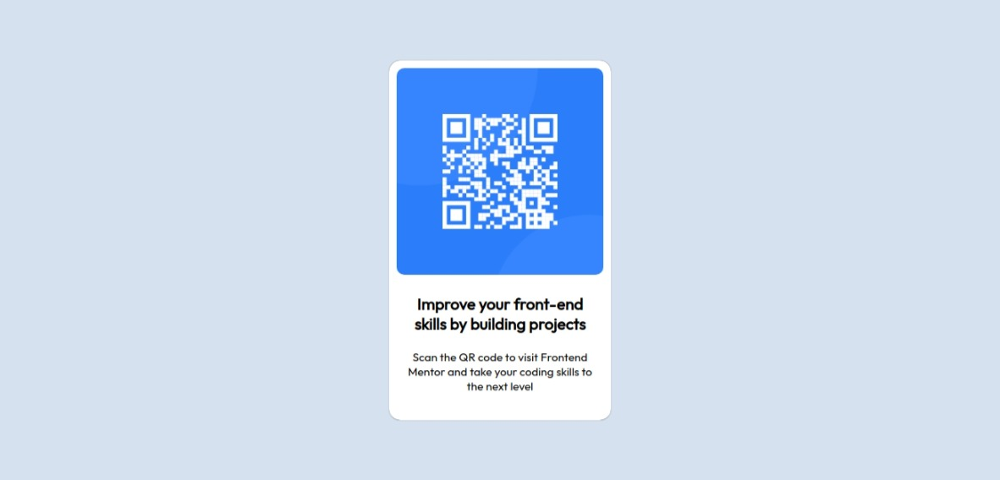

# Frontend Mentor - QR code component solution

This is a solution to the [QR code component challenge on Frontend Mentor](https://www.frontendmentor.io/challenges/qr-code-component-iux_sIO_H). Frontend Mentor challenges help you improve your coding skills by building realistic projects. 

## Overview
Project to practice HTML and CSS

### Screenshot

### Links

- Solution URL: [Add solution URL here](https://your-solution-url.com)
- Live Site URL: [Site](https://qr-component-lake.vercel.app/)

## My process

### Built with

- Semantic HTML5 markup
- CSS custom properties
- Flexbox
- Mobile-first workflow

### What I learned

I learned Flexbox, how to style a image.

### Continued development

In the next projects I want to manipulate DOM therefore I will include JS in them.

## Author

- Website(not enabled) - [Nicolás Ortiz](#)
- Frontend Mentor - [@nico-ortiz](https://www.frontendmentor.io/profile/nico-ortiz)
